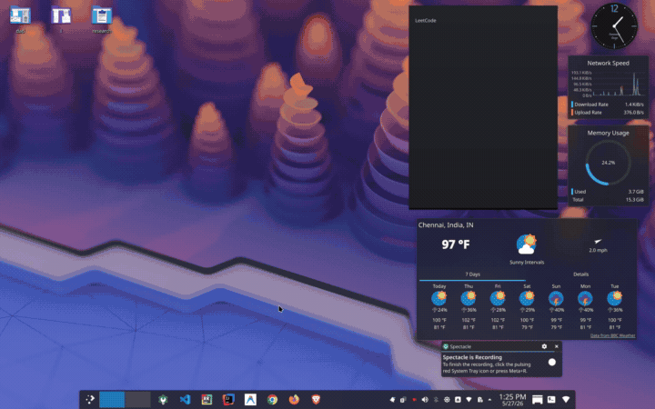

# Developer's Homepage Dashboard

[](https://devlopers-hompage.netlify.app/)
[](https://github.com/Harsh-pa-thak/Browser-Homepage/raw/main/browser-homepage-extension.zip)
[](https://harsh-pathak.netlify.app/)
[](https://github.com/Harsh-pa-thak/Browser-Homepage)
[](./LICENSE)

A highly responsive and functional browser homepage designed specifically for developers. Featuring integrated widgets, custom Bento grids, and seamless service integrations, this dashboard is designed to optimize daily developer workflows.

---
### Demonstration Walkthrough


## Chrome Extension (Manifest V3)

Browser Homepage is also available as a native **Manifest V3 Chrome Extension** for the ultimate seamless developer experience:

- **New Tab Override**: Replaces Chrome's default new tab page with your customized developer dashboard instantly.
- **Toolbar Popup Menu**: Click the extension icon in your browser toolbar anytime, anywhere to open a compact quick-links menu with all your configured shortcuts.
- **Native Secure OAuth (`chrome.identity`)**: Gmail authentication runs natively via Chrome Identity API. Tokens are managed directly by your browser and never leave your local machine.
- **Custom Shortcut Icons**: Easily customize any shortcut's display name, URL, or icon image directly from the Settings panel.

### Quick Install (No Terminal Needed)

Click below to download the ready-to-use extension package directly:

**[Download Chrome Extension (.zip)](https://github.com/Harsh-pa-thak/Browser-Homepage/raw/main/browser-homepage-extension.zip)**

#### 3 Easy Steps to Install:
1. **Unzip** the downloaded `browser-homepage-extension.zip` file on your computer.
2. Open Google Chrome (or Brave / Edge) and go to **`chrome://extensions`** (turn on **Developer mode** switch in the top right corner).
3. Click **Load unpacked** and select the unzipped folder.

That's it! Open a new tab to see your new developer homepage.

---
## Key Features

- **Bento Grid Layout**: A structured and organized grid system that centralizes essential developer tools and custom widgets.
- **Smart Search Bar**: Direct search bar capabilities with immediate access to major search engines.
- **LeetCode Integration**: Live tracking of daily coding challenges and key metrics to monitor progress.
- **GitHub Integration**: Direct display of personal repositories, issues, and contribution metrics.
- **Gmail Integration**: Real-time access to user inbox notifications and email updates.
- **Advanced Settings Panel**: Full customization capabilities, allowing users to toggle widgets, configure color palettes, and personalize layout configurations.
- **Modern User Experience**: A clean interface featuring contemporary glassmorphism design and smooth, responsive interactive micro-animations.

---

## Screenshots and Previews

### Dashboard Interface


### Customization Settings


---

## Live Deployment (Web Version)

This is a production-ready, fully hosted web application. No local installation or compilation is required to utilize the web dashboard.

Access the live application directly:
**[https://devlopers-hompage.netlify.app/](https://devlopers-hompage.netlify.app/)**

---

## Browser Setup Guide (Web App)

To integrate the web dashboard into your workflow without the Chrome extension, configure it as your browser's default homepage or new tab page.

### Visual Walkthrough
A step-by-step demonstration of the browser configuration process is embedded below:


- Image references are located in the [`demo/`](./demo/) directory:
  - [`Screenshot_20260527_130225.png`](./demo/Screenshot_20260527_130225.png)
  - [`Screenshot_20260527_130245.png`](./demo/Screenshot_20260527_130245.png)

### Setup Steps
1. **Configure Homepage**:
   - Navigate to your browser's **Settings** menu.
   - Locate the **Homepage and new windows** or **On startup** section.
   - Choose the option to **Open a specific page or set of pages**, select **Add a new page**, and input: `https://devlopers-hompage.netlify.app/`.
2. **Configure New Tab Page**:
   - To launch the dashboard automatically upon opening any new tab, utilize a secure browser extension such as **Custom New Tab URL** (compatible with Google Chrome, Brave, Microsoft Edge, and Mozilla Firefox).
   - Enter `https://devlopers-hompage.netlify.app/` into the extension configuration field.

---

## Gmail API Access

When connecting your Gmail account, you may see a warning that the app is not verified. This is normal during the pre-verification period and does not affect the functionality.

**How to proceed:**

1. When the warning page appears, click on **Advanced**.
2. Then click on **Go to [app name] (unsafe)** to continue.
3. Follow the prompts to authorize Gmail access.

After giving permission, the Gmail features will work normally.

If you have trouble, contact the developer:  
- **Developer Contact**: [https://harsh-pathak.netlify.app/](https://harsh-pathak.netlify.app/)

---

## Open Contributions

This project welcomes contributions from the developer community.

To contribute:
1. **Branch Creation**: Create a new branch named after yourself:
   ```bash
   git checkout -b your-name
   ```
2. **Implementation**: Make your targeted improvements, visual refinements, or bug fixes.
3. **Submission**: Commit, push the branch to the origin repository, and submit a **Pull Request (PR)** detailing the changes introduced.

---

## Author and Creator

Developed and maintained by **Harsh Pathak**.
- Portfolio: [https://harsh-pathak.netlify.app/](https://harsh-pathak.netlify.app/)

---

## License and Copyright

This project is licensed under the terms of the MIT License. Refer to the [LICENSE](./LICENSE) file for complete terms and conditions.

Copyright © 2026 Harsh Pathak. All rights reserved.
